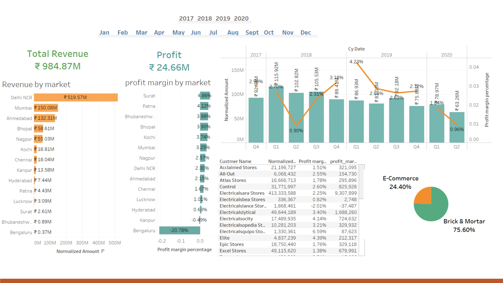

# Analysis-of-sales-insight
Case study is based on a AtLIQ computer hardware business which is facing challenges in dynamically changing market. Sales director decides to invest in data analysis project and he would like to build Tableau dashboard that can give him real time sales insights.
## Problem statement 
1.Revenue breakdown by cities
2.Revenue breakdown by years and months
3.Show me top 5 customers by revenue and sales quantity
4.Top 5 products by revenue number

